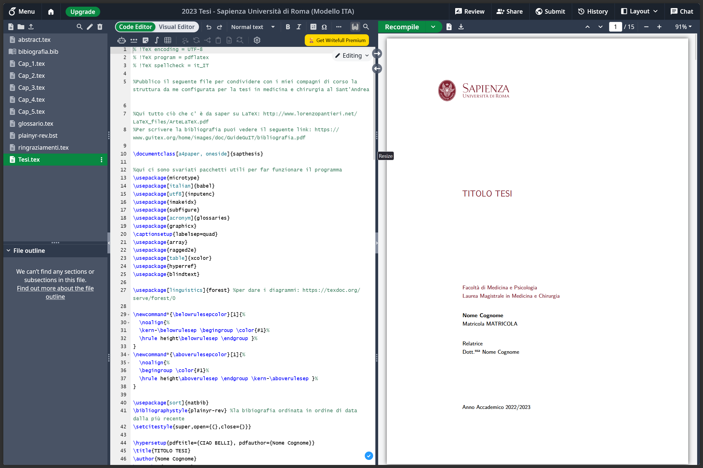

**Guida semplice a LaTeX & Overleaf per la tua tesi 😃**

Ehi, studente di Medicina della Sapienza! Questa guida è fatta apposta per te, anche se è la prima volta che senti parlare di LaTeX 😉

### Cosa troverai qui:

* **Perché scegliere LaTeX** e non Word
* **Overleaf**: l’editor online che ti semplifica la vita
* **Template Sapienza**: come partire già con il vestito giusto (usa questo link ➡️ \[INSERISCI QUI IL LINK AL TEMPLATE])
* **Struttura base** di un file `.tex`
* **Inserire figure** e riferimenti incrociati
* **Bibliografia & citazioni**
* **Liste puntate e numerate**
* **Tips & trucchetti** per non impazzire 💪

---

## 1. Perché LaTeX?

* 📑 *Aspetto professionale*: impaginazione da manuale
* 🔄 *Automazione*: numeri di capitoli, riferimenti e bibliografia si aggiornano da soli
* 🛡 *Robusto*: niente spostamenti strani di pagine

Con LaTeX scrivi un file di testo (es. `main.tex`) e, con un click, ottieni un PDF super curato.

## 2. Overleaf: l’editor online

Overleaf ti evita l’installazione di software:

1. Registrati su [overleaf.com](https://www.overleaf.com) con la tua email Sapienza
2. Crea un progetto nuovo → “Blank Project” oppure importa il *template* Sapienza dal link qui sopra
3. Vedrai:

   * **main.tex**: dove scrivi
   * **bibliography.bib**: per le fonti
   * **images/**: la cartella per le tue figure

> Ogni volta che salvi, Overleaf ricompila e ti mostra l’anteprima in PDF!


## 3. Il tuo primo `.tex` minimale

```latex
\documentclass[12pt,a4paper]{report}
\usepackage[utf8]{inputenc}
\usepackage[T1]{fontenc}
\usepackage[italian]{babel}
\usepackage{graphicx}
\usepackage{biblatex}
\addbibresource{bibliography.bib}

\title{Titolo della tua Tesi}
\author{Il tuo Nome}
\date{Mese Anno}

\begin{document}
  \maketitle
  \tableofcontents

  \chapter{Introduzione}
  Qui ci va il tuo testo iniziale...

  \chapter{Materiali e Metodi}
  Descrivi esperimenti, protocolli, ecc.

  \printbibliography
\end{document}
```

## 4. Inserire figure 🎨

```latex
\begin{figure}[h]
  \centering
  \includegraphics[width=0.6\textwidth]{images/tuafoto.png}
  \caption{Descrizione della figura}
  \label{fig:esperimento}
\end{figure}
```

* Metti `tuafoto.png` nella cartella `images`
* Richiama la figura con `Figura \ref{fig:esperimento}`

---

## 5. Liste puntate e numerate 📝

* Elenchi puntati:

  ```latex
  \begin{itemize}
    \item Primo punto
    \item Secondo punto
  \end{itemize}
  ```
* Elenchi numerati:

  ```latex
  \begin{enumerate}
    \item Passo 1
    \item Passo 2
  \end{enumerate}
  ```

## 6. Bibliografia e citazioni 📚

1. Aggiungi le tue fonti in `bibliography.bib`:

   ```bibtex
   @article{rossi2020,
     author = {Rossi, Mario},
     title  = {Studio del microbiota},
     journal= {Giornale Medico},
     year   = {2020}
   }
   ```
2. Cita nel testo con `\cite{rossi2020}`
3. Alla fine, `\printbibliography` genera l’elenco completo

---

## 7. Tips & Trucchetti 🔍

* 🏷 Usa `\label{}` e `\ref{}` per riferimenti che si aggiornano da soli
* 🔎 Compila spesso: Overleaf ti segnala errori in tempo reale
* 🗂 Organizza file e cartelle (figure, bib, capitoli separati…)
* 🔄 Se collabori, puoi usare Git integrato in Overleaf

Buon lavoro e… goditi la scrittura della tesi! 🍀
